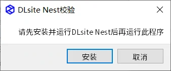
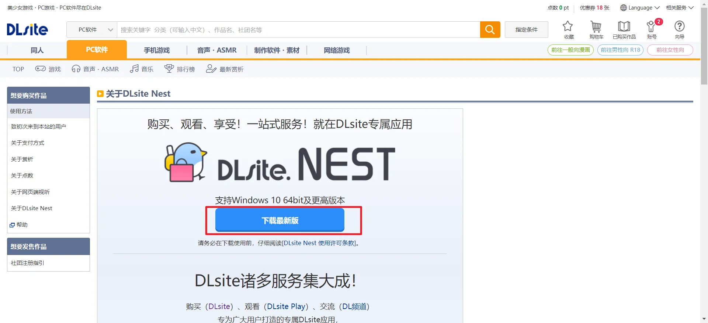
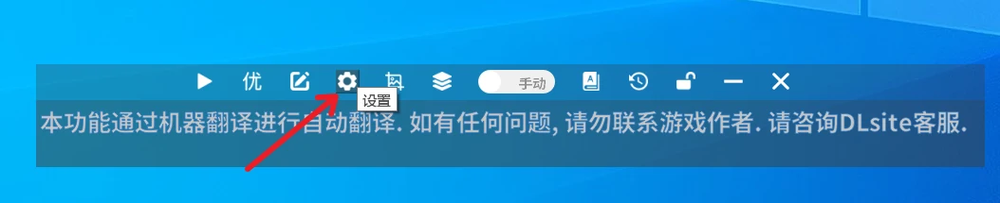
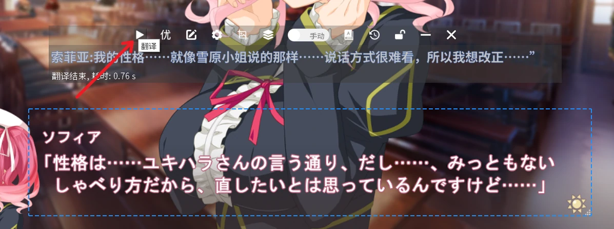

### 1.打开应用
1. 将软件压缩包解压后，双击`AutoTranslator.exe`即可运行软件
    - 

2. 首次启动时会提示需要安装DLsite Nest后才可使用本翻译器，下载并安装该软件后再次重启AUTD翻译器即可
    - 
    - 

### 2.配置ocr

第一次使用时需要打开设置配置一次ocr以及翻译源，此后无需再做更改，设置入口如图所示

- ocr的作用是提取图片中的文字内容，随后软件会调用翻译接口对这些文字进行翻译

1. 软件内ocr现在提供了在线与离线两种模式
    - 在线模式由我们服务器提供运算服务，无需占用本地cpu，对电脑性能几乎无要求，新用户可免费试用3天在线ocr，或点击`购买方案`补充付费时长，具体可查看[在线ocr说明](dl/else.md#在线ocr说明)
    - 离线模式需要下载模型至本地电脑，对cpu占用及电脑性能要求较高

2. 选择需要翻译的原文语种，软件目前支持`日语和英语`
    - 

### 3.配置翻译源
- 若处于3天试用期或已购买付费方案的用户，无需配置此项
- 翻译源的作用是将前面ocr提取到的文本翻译为中文
- 软件提供了多达9种`在线翻译源`，可同时开启多种翻译源对比进行查看
- 翻译源对比及每种翻译源配置请查看[各翻译源注册](dl/translator.md)

### 4.框选翻译区域及翻译
1. 点击翻译器功能区域的`范围选择按钮`，框选出游戏内的文字框，正常情况下选择区域后便会立刻出现翻译内容

- `注意翻译区域不要与翻译器页面重合`，可以把翻译器`放到翻译区域下方或上方`

- 

- 之后每句话需要手动点击翻译按钮进行翻译
- 

2. 也可以切换为自动翻译模式，这样在游戏文本发生改变时，也会自动进行翻译操作

- 

3. 更多翻译功能的调整如人名的替换可以查看[高级功能](dl/full.md)