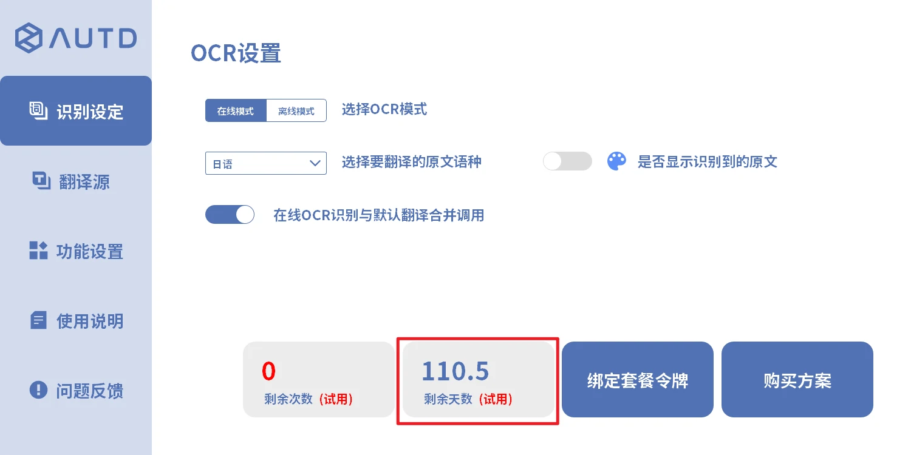
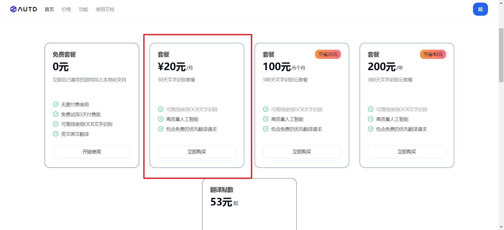
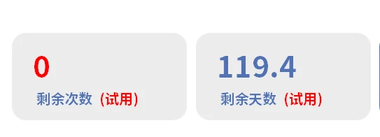
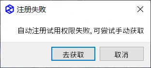
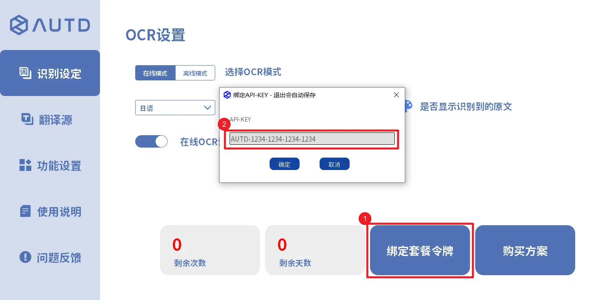

### 在线ocr说明

- 本软件`在线ocr`为收费功能，注册时会提供三天的试用时长，如时长到期后，可使用离线ocr(免费)，或点击`购买方案`前往官网购买付费包
    - 

    - 

- 在购买下单后，重启翻译器即可看到购买后的时长，若未自动更新时长，也可以[手动绑定套餐令牌](#绑定套餐令牌)
    - 

### 绑定套餐令牌
- 软件在首次启动时，便会自动注册一个3天在线ocr试用的套餐令牌，该令牌类似其他软件的账号，格式为`AUTD-xxxx-xxxx-xxxx-xxxx`,请勿将其随便泄漏给他人
- 若软件首次启动时网络错误，令牌自动注册失败，也可以点击`去获取`，在官网购买付费包，获取到新的令牌密钥后，回软件内手动绑定套餐令牌，即可更新软件的在线ocr剩余天数
  - 
  - 
