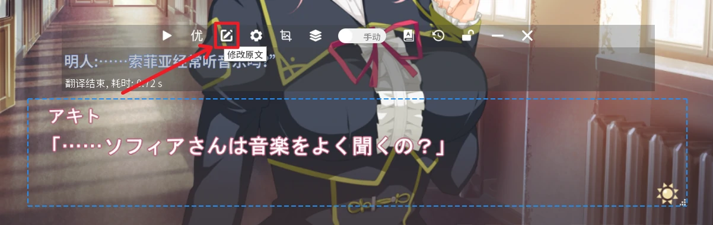
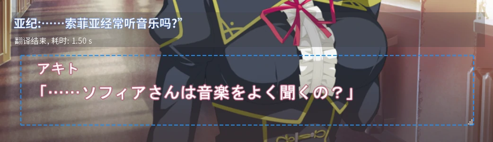
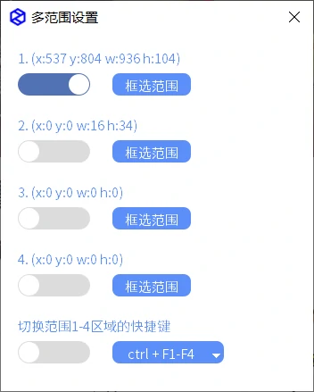
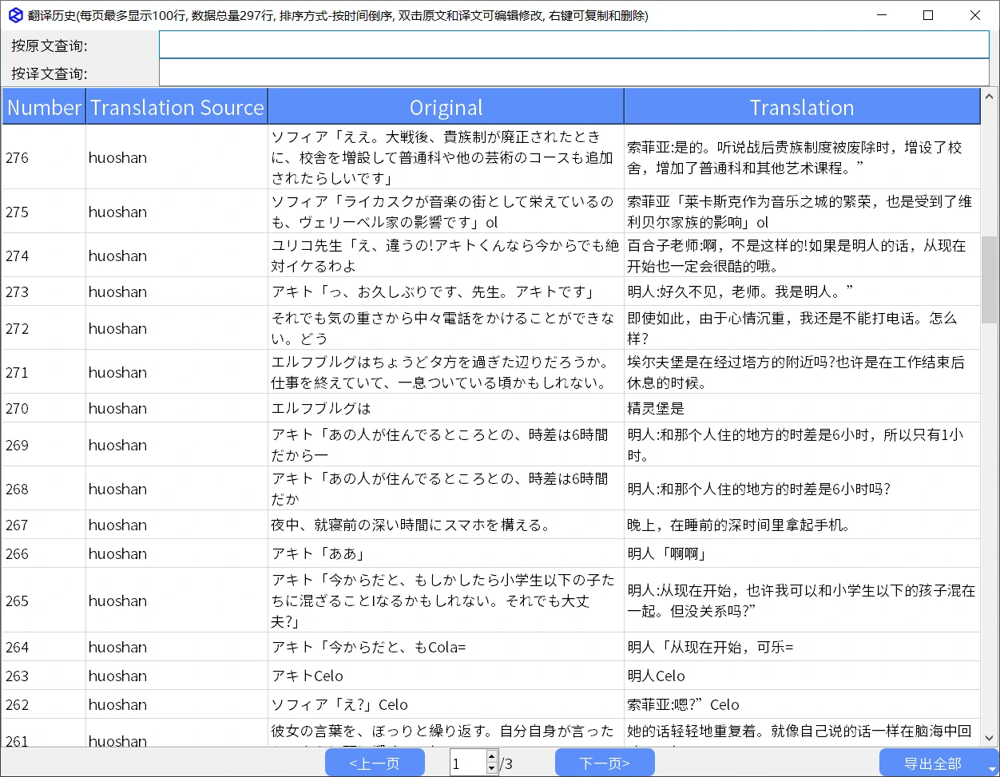
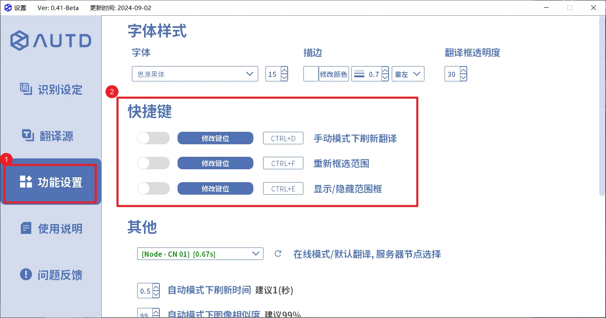

### 翻译文本替换
1. 如机翻过程中错误翻译了部分文本，如人名之类的，可使用`修改原文`(单次修改原文或方便复制原文)，以及`词库功能`(永久替换该词)功能

    - 
2. 如上图错误翻译了人名，可以先复制下人名的原文，然后打开`词库设置`
    - 

输入原文以及正确的人名，生效范围建议选择`原文`，随后关闭窗口，重新点击`翻译按钮`即可显示替换后的文本
- 
- 

### 多范围设置

1. 翻译器本身是无法框选多个范围文本同时进行翻译的，但可以设置多个选定范围，通过快捷键在不同范围间切换翻译
    - 

至多可以登记四个文本区域，每个文本区域点击`框选范围`后，便可以登记该选区，然后通过`ctrl+F1`等按键切换当前所选区域

- 

### 翻译历史

如需查看之前的翻译记录，或批量复制原文/译文等，可打开`翻译历史`按钮，这里可查看之前的翻译记录，或进行导出
- 
- 

### 快捷键设置

在进入设置页面后，可点击左侧`功能设置`选项，配置手动翻译，重新选区等功能的快捷键

- 
