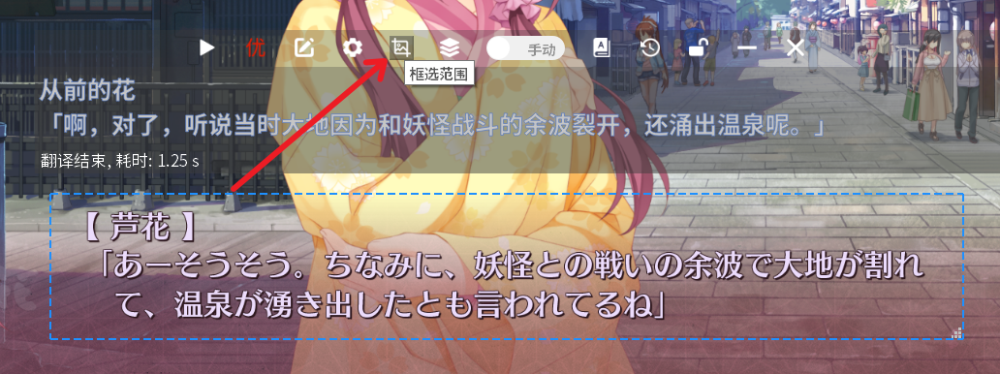
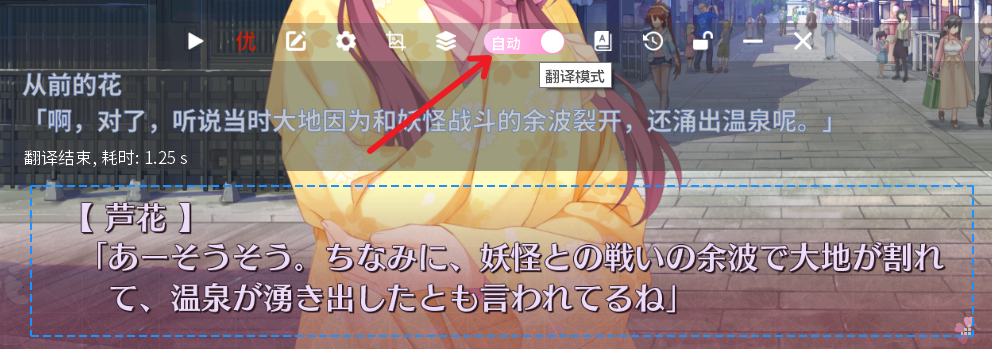
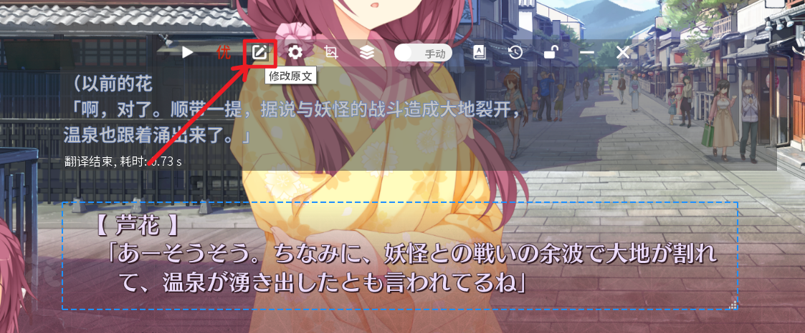

## 快速使用
### 1.打开应用
1. 将软件压缩包解压后，双击`AutoTranslator.exe`即可运行软件
   - 

2. 首次启动时会提示需要安装DLsite Nest后才可使用本翻译器，下载并安装该软件后再次重启AUTO翻译器即可
   - 
   - 

### 2.配置ocr

第一次使用时需要打开设置配置一次ocr以及翻译源，此后无需再做更改，设置入口如图所示

- ocr的作用是提取图片中的文字内容，随后软件会调用翻译接口对这些文字进行翻译

1. 软件内ocr现在提供了在线与离线两种模式
   - 在线模式由我们服务器提供运算服务，无需占用本地cpu，对电脑性能几乎无要求，新用户可免费试用3天在线ocr，或点击`购买方案`补充付费时长，具体可查看[在线ocr说明](#在线ocr说明)
   - 离线模式需要下载模型至本地电脑，对cpu占用及电脑性能要求较高

2. 选择需要翻译的原文语种，软件目前支持`日语和英语`
   - 

   

### 3.配置翻译源
- 若处于3天试用期或已购买付费方案的用户，无需配置此项
- 翻译源的作用是将前面ocr提取到的文本翻译为中文
- 软件提供了多达9种`在线翻译源`，可同时开启多种翻译源对比进行查看
- 翻译源对比及每种翻译源配置请查看[各翻译源注册](#各翻译源注册)

### 4.框选翻译区域及翻译
1. 点击翻译器功能区域的`范围选择按钮`，框选出游戏内的文字框，正常情况下选择区域后便会立刻出现翻译内容

  - `注意翻译区域不要与翻译器页面重合`，可以把翻译器`放到翻译区域下方或上方`

  - 

  - 之后每句话需要手动点击翻译按钮进行翻译
  - 

2. 也可以切换为自动翻译模式，这样在游戏文本发生改变时，也会自动进行翻译操作

  - 

3. 更多翻译功能的调整如人名的替换可以查看[高级功能](#高级功能)

## 高级功能
### 翻译文本替换
1. 如机翻过程中错误翻译了部分文本，如人名之类的，可使用`修改原文`(单次修改原文或方便复制原文)，以及`词库功能`(永久替换该词)功能

	- 
2. 如上图错误翻译了人名，可以先复制下人名的原文，然后打开`词库设置`
	- 

输入原文以及正确的人名，生效范围建议选择`固定翻译`，随后关闭窗口，重新点击`翻译按钮`即可显示替换后的文本
	- 
	- 

### 多范围设置

1. 翻译器本身是无法框选多个范围文本同时进行翻译的，但可以设置多个选定范围，通过快捷键在不同范围间切换翻译
   - 

至多可以登记四个文本区域，每个文本区域点击`框选范围`后，便可以登记该选区，然后通过`ctrl+F1`等按键切换当前所选区域

   - 

### 翻译历史

如需查看之前的翻译记录，或批量复制原文/译文等，可打开`翻译历史`按钮，这里可查看之前的翻译记录，或进行导出
	- 
	- 

### 快捷键设置

在进入设置页面后，可点击左侧`功能设置`选项，配置手动翻译，重新选区等功能的快捷键

- 

## 其他支持

### 在线ocr说明

- 本软件`在线ocr`为收费功能，注册时会提供三天的试用时长，如时长到期后，可使用离线ocr(免费)，或点击`购买方案`前往官网购买付费包
    - 

    - 

- 在购买下单后，重启app即可看到购买后的时长
	- 

## 翻译源配置

### 各种翻译源对比

||免费额度|推荐等级|翻译质量|
|:--:|:--:|:--:|:--:|
|[默认](#默认翻译)|付费期间无限次使用|⭐⭐⭐⭐⭐|⭐⭐⭐⭐|
|[火山](#火山翻译)|200w字符/月|⭐⭐⭐⭐⭐|⭐⭐⭐⭐|
|[小牛](#小牛翻译)|20w字符/天|⭐⭐⭐⭐⭐|⭐⭐⭐⭐|
|[腾讯](#腾讯翻译)|500w字符/月|⭐⭐⭐⭐|⭐⭐⭐|
|[百度](#百度翻译)|100w字符/月|⭐⭐⭐⭐|⭐⭐⭐|
|[gpt](#ChatGPT翻译)|需自行购买第三方中转key|⭐⭐⭐|⭐⭐⭐⭐⭐|
|[阿里](#阿里翻译)|100w字符/每月|⭐⭐⭐|⭐⭐⭐|
|[彩云](#彩云小译)|`一次性`100w字符|⭐⭐|⭐⭐⭐⭐|
|[有道](#有道翻译)|`一次性`约120w字符|⭐⭐|⭐⭐⭐|

### 各翻译源注册
1. 除默认翻译付费后开启开关就能使用外，其他翻译源都是需要自行去各个网站注册对应翻译源
2. 最后将各个网站给的密钥复制，粘贴到AUTO翻译器内对应位置，点击测试可用后，再打开该翻译源的开关
3. 以火山翻译举例，注册完成获取到密钥后，填入密钥，进行测试，再打开开关
  - 

#### 默认翻译
- 默认翻译任何用户都可以使用，不过在用户高峰时段，翻译请求可能会较慢
- 如对翻译速度有要求，可点击默认翻译设置的`购买`按钮，前往官网购买翻译点数，拥有翻译点数时，将享有优先翻译权限
  - 

[点此返回翻译器教程](#配置翻译源)

#### 腾讯翻译

- 腾讯翻译免费额度为`500w字符/月`，`额度用完后会无法使用，用完建议更换其他翻译源`

- [点击查看腾讯翻译使用量](https://console.cloud.tencent.com/tmt)，登录后筛选`近30天`使用量

1. [点击打开腾讯翻译注册网站](https://cloud.tencent.com/product/tmt)，右上角完成账号注册或登录
   - 

2. 注册完成后点击`去实名认证`
   - 

3. 这里选择`开始个人认证`（在其他页面完成了个人认证也行）
    - 

4. 姓名和身份证要真实，地址无所谓
    - 

5. 微信扫码完成认证（用别的认证方法也行）
   - 
   - 

6. 完成个人认证后再[打开机器翻译页面](https://cloud.tencent.com/product/tmt)，点击`立即使用`
    - 

7. 勾选协议，点击`开通付费版`，同样会有`500w字符/月免费额度`，用完后因为没钱也不会扣你钱，如之前未进行实名认证的在这完成实名也行
    - 

8. 开通机器翻译后，再打开[新建密钥页面](https://console.cloud.tencent.com/cam/capi)
9. 点击下面的新建密钥
    - 

10. 这里的`两行字符`就是我们需要的密钥，将得到的两个密钥复制到AUTO翻译器内`腾讯`的密钥编辑框，然后点击`测试`按钮查看可用性
    - 

[点此返回翻译器教程](#配置翻译源)

#### 彩云小译

- 彩云小译新用户免费额度只有一次性的`一个月有效期`的`100w字符`，用完建议更换其他翻译源
- [点击查看彩云小译使用量](https://platform.caiyunapp.com/application/manage),显示的`今日剩余调用量`实际是全部剩余可免费使用的调用量

1. [点我打开彩云翻译注册网站](https://platform.caiyunapp.com/)
2. 使用邮箱完成注册并进行登录
3. 点击`立即认证`，然后是`个人开发者认证`

   - 
   - 

4. 填写一些个人信息并绑定手机号，所属行业和应用场景随机填都行

   - 

5. 点击提交后点击`创建应用`

   - 

6. 应用设置这里，应用名称随便填写，接口类型一定要选择`翻译`，之后点击`新建`

   - 

7. 应用类型为`翻译`的应用的`token`，就是翻译器需要的密钥

   - 

8. 将彩云的这个`token`复制粘贴到AUTO翻译器内`彩云翻译`的密钥编辑框，然后点击`测试`按钮查看可用性

[点此返回翻译器教程](#配置翻译源)

#### 阿里翻译

- 阿里翻译免费额度为`100w字符/每月`，`超出部分按100w字符/50元计费`，如果超出字符，且账号没有余额，最多会产生一个小时内的欠费账单，具体参考[阿里云机器翻译产品定价](https://help.aliyun.com/document_detail/197134.html)
- [点击查看阿里翻译使用量](https://mt.console.aliyun.com/service)

1. [点我打开阿里云网站](https://www.aliyun.com/),点击`右上角登录/注册`
2. 建议使用下面的支付宝或淘宝直接登录，可以省去实名认证
   - 

3. 登录完成并实名认证后，打开[阿里云机器翻译](https://www.aliyun.com/product/ai/base_alimt)页面,点击`立即开通`
   - 

4. 勾选用户协议，点击`立即开通`
   - 

5. 点击管理控制台
   - 

6. 鼠标移到右上角头像上，点击`AccessKey管理`
   - 

7. 选择`继续使用AccessKey`，(如对安全有需求，也可以选择`开始使用子用户AccessKey`，并对子账号`添加翻译相关权限`)
   - 

8. 点击`创建AccessKey`，并通过短信校验等认证方式
   - 

9. 复制这里的两个密钥到AUTO翻译器内`阿里云`的密钥编辑框，然后点击`测试`按钮查看可用性
   - 

[点此返回翻译器教程](#配置翻译源)

#### 火山翻译

- 火山翻译免费额度为`200w字符/月`，`额度用完后会继续扣费`,请留意该翻译源的额度使用情况，避免造成账号欠费
- [点击查看火山翻译使用量](https://console.volcengine.com/translate/usage)

1. [点我打开火山翻译网站](https://www.volcengine.com/),点击`右上角登录或立即注册`
   - 

2. 登录完成后，[点我跳转实名认证页面](https://console.volcengine.com/user/authentication/)

3. 点击个人认证，建议使用`扫码认证(需要抖音app)`或是`银行卡认证`，按提示完成相应操作
   - 
   - 
   - 

4. 认证成功后，[点我跳转开通翻译页面](https://console.volcengine.com/translate)

5. 勾选协议并点击`立即开通`
   - 
   - 

6. 开通翻译成功后，[点我跳转用户管理页面](https://console.volcengine.com/iam/identitymanage/user)

7. 点击`新增用户`,选择`通过用户名创建`
   - 
   - 

8. 用户名可以填写`translator`，勾选`编程访问`，再点击下一步
    - 

9. 在搜索框内输入`翻译`,`勾选`得到的两个选项，作用范围选择`全局`，再点击下一步
    - 

10. 信息确认无误后点击`提交`
    - 

11. 回到这个用户管理界面后，点击`管理`
    - 

12. 点击`密钥`，分别点击两个复制按钮，将这里的两个密钥复制到AUTO翻译器内`火山`的密钥编辑框，然后点击`测试`按钮查看可用性
    - 

[点此返回翻译器教程](#配置翻译源)

#### 百度翻译

- 百度翻译免费额度为`100w字符/月`，`额度用完后也不会扣费`，只是无法继续使用翻译，用完建议更换其他翻译源
- [点击查看百度翻译使用量](https://fanyi-api.baidu.com/api/trans/product/desktop),如果提示登录，请先登录后重新点击此地址查看

1. [点击打开百度翻译注册网站](https://fanyi-api.baidu.com/product/11)，完成登录后点击`立刻使用`

    - 

2. 然后选择个人开发者，并填写自己相关信息

    - 

3. 点击确定

    - 

4. 选择`高级版`，并到下面填写自己个人信息，点击立刻实名
    - 
    - 如果你碰到此处`没有填写姓名和身份证的地方`，可采用如下解决办法
    - 按<kbd>Ctrl</kbd>+<kbd>F5</kbd>强制刷新一下网页，然后稍等一会儿
    - 也可以换浏览器重试，[chrome](https://www.google.cn/chrome/)，[firefox](https://www.mozilla.org/zh-CN/firefox/windows)，[edge](https://www.microsoft.com/zh-cn/edge)三选一，不要用国产浏览器

5. 点击开通服务
    - 

6. 选择通用翻译
    - 

7. 开通高级版
    - 

8. 点击下一步
    - 

9. 应用名称随便填，例如填写`翻译器`，然后别的东西都不用填，`提交申请`就行了，这个没人工审核，会直接通过的
    - 

10. 服务开通后点击`总览`
    - 

11. 页面滑到最下面，有个申请信息，里面是`appid和密钥`，将得到的appid和密钥复制粘贴到AUTO翻译器内`百度`的密钥编辑框，然后点击`测试`按钮查看可用性
    - 

[点此返回翻译器教程](#配置翻译源)

#### 小牛翻译

- 小牛翻译免费额度为`每天20w字符`，首次注册需要`关注微信公众号领取100w字符`，`超出部分按1000w字符/500元计费`，用完建议更换其他翻译源
- [点击查看小牛翻译使用量](https://niutrans.com/cloud/service/flows)

1. [点我打开小牛翻译网站](https://niutrans.com/),点击`右上角登录或免费注册`
    - 

2. 建议选择微信扫码注册
    - 

3. 手机端扫码关注公众号后，点击右下角`新客福利`，领取`100w字符流量`
    - 
    - 
    - 

4. 回到pc端，点击`去登录`，回到登录页面后，使用`微信`方式再次登录(扫码登录跳转可能会比较慢，可以多等一会儿)
    - 
    - 

5. 点击左侧`个人中心`，再点击`API-KEY`旁边的`绑定`按钮，并绑定手机号
    - 

6. 完成手机号绑定后，点击`显示`后，复制这个密钥到AUTO翻译器内`小牛`的密钥编辑框，然后点击`测试`按钮查看可用性
    - 

[点此返回翻译器教程](#配置翻译源)

#### 有道翻译

- 有道翻译免费额度为`10元代金券，约可以翻译20w字符`，添加客服微信后，并再登记完成一些信息，可再获得`50元代金券,约100w字符`，`超出部分按100w字符/50元计费`，用完建议更换其他翻译源
- [点击查看有道翻译使用量](https://ai.youdao.com/console/#/finance-overview)，主要看体验金剩余多少，体验金归0就无法使用了

1. [点我打开有道智云网站](https://ai.youdao.com/),点击`右上角登录/注册`
    - 

2. 完善信息这里随便填就行
    - 

3. 这里的有道的客服微信号可以加一下，回答他的一些登记问题就能领取剩下`50元代金券`
    - 

4. 点击跳过接入指南
    - 

5. 进行实名认证，选择`个人认证`，完善相关信息
    - 
    - 
    - 

6. 左侧选择`文本翻译`，右上角点击`创建应用`
    - 

7. 按照下面图片填写应用信息
    - 
    - 

8. 点击左侧`业务总览`，分别点击两个复制按钮，将这里的应用id和应用密钥复制到AUTO翻译器内`有道`的密钥编辑框，然后点击`测试`按钮查看可用性
    - 

[点此返回翻译器教程](#配置翻译源)

#### ChatGPT翻译
- gpt官方接口限制较多，建议使用第三方的中转接口
- 需要先去某宝搜索`gpt中转`等关键词搜到第三方接口和密钥，最后将店主给的地址与密钥填入到翻译器的gpt设置内即可使用
- 第三方gpt平台所产生的费用与AUTO翻译器无关

1. 需要先去某宝搜索`gpt中转`等关键词搜到第三方接口和密钥
2. 商品发货后，一般会提供一个key，以及一个接口地址，一般形如`https://xxx.com/v1/chat/completions`，下图中的路由请求就是接口地址
    - 

3. 将复制的完整key，以及代理地址填入到翻译器ChatGPT密钥页面
    - 
    - 若商家只提供了一个域名`https://xxx.com`，后面需要自己接上完整的接口地址，如`https://xxx.com/v1/chat/completions`
4. 之后需要配置代理地址，若使用的软件是`clash`，clash默认的端口是7890，翻译器内则填写`127.0.0.1:7890`即可
    - 其他软件需要得知代理端口是多少，一般在打开`windows设置-网络和internet-代理`页面，可以看到代理端口是多少，AUTO翻译器内则填写`127.0.0.1:端口号`
      - 
5. 其他的配置项
    - 可以根据自己账号的权限选择不同的gpt模型，一般账号都是拥有gpt3.5的模型权限
    - 联系上下文开启后, chatgpt会联系之前翻译过的句子场景进行翻译, 可能会提高翻译准确率, 但是会消耗更多的翻译额度，最大句子数为10
    - 催眠话术不建议修改原有话术内容，随意修改可能导致翻译结果无法解析，建议在话术最底部增加自己的条目
6. 随后点击`测试`按钮，看能否正常使用，能正常使用后关闭密钥页面，并打开gpt翻译的开关;若不可用，请检查代理软件或代理地址是否可用
    - 